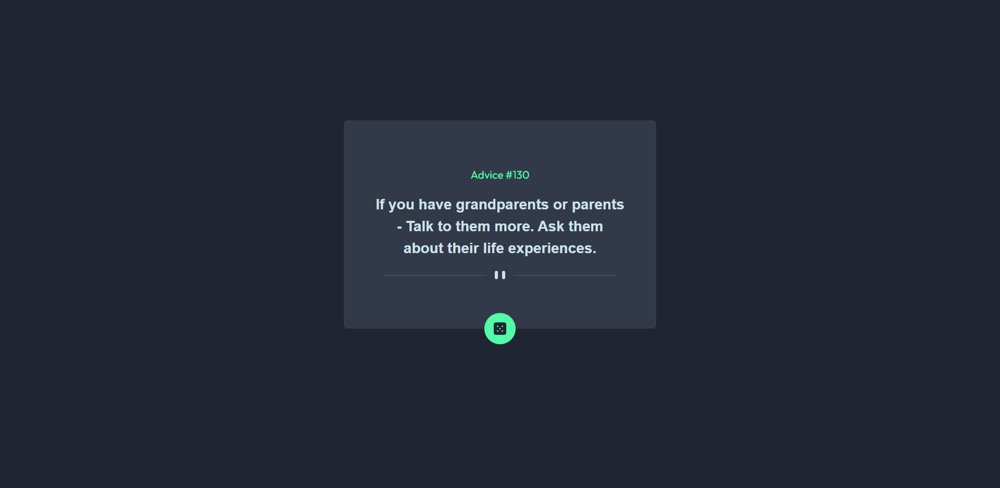

# Frontend Mentor - Advice generator app

# Code that i consider important
fetch('https:/any-webp.com/advice')
    .then(response => response.json())
    .then(data => {
      const advice = data.slip.advice;
      randomQuote.innerHTML = advice;
    })
    .catch(error => {
      console.log('An error occurred:', error);
    });